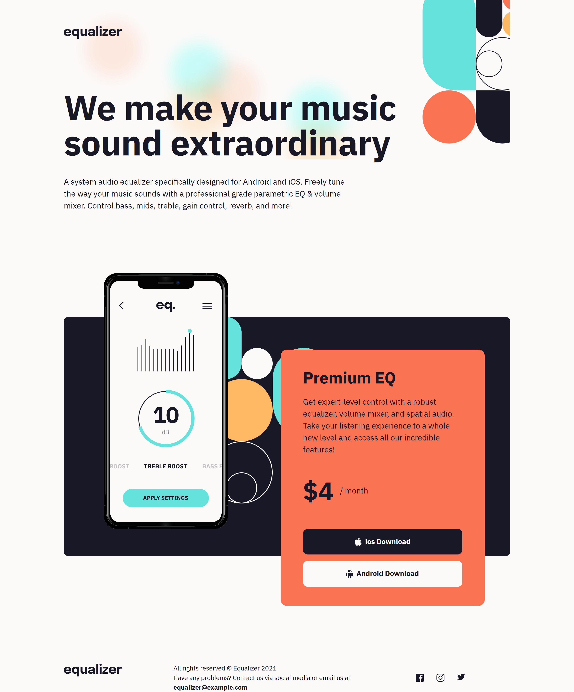

# Frontend Mentor - Equalizer landing page solution

This is a solution to the [Equalizer landing page challenge on Frontend Mentor](https://www.frontendmentor.io/challenges/equalizer-landing-page-7VJ4gp3DE). Frontend Mentor challenges help you improve your coding skills by building realistic projects.

## Table of contents

- [Overview](#overview)
  - [The challenge](#the-challenge)
  - [Screenshot](#screenshot)
  - [Links](#links)
  - [Features](#Features)
  - [Installation](#Installation)
- [My process](#my-process)
  - [Built with](#built-with)
  - [Continued development](#continued-development)
  - [Useful resources](#useful-resources)
- [Author](#author)
- [Acknowledgments](#acknowledgments)

## Overview

### The challenge

Users should be able to:

- View the optimal layout depending on their device's screen size
- See hover states for interactive elements

### Screenshot




### Links

- Solution URL: [Solution URL](https://github.com/nishanth1596/article-preview-component)
- Live Site URL: [Live site URL](https://nishanth-equalizer-landing-page.netlify.app/)

### Features

- **Responsive Design**: The card layout adapts seamlessly from mobile to desktop view.
- **Dynamic Content**: Components are reusable, making it easy to extend the functionality or update the content.

### Installation

To run this project locally:

1. Clone this repository:

   ```bash
   git clone https://github.com/nishanth1596/social-proof-section.git
   ```

2. Navigate into the project directory:
   cd social-proof-section

3. Install dependencies:
   npm install

4. Start the development server:
   npm run dev

5. Open the project in your browser at http://localhost:5173

## My process

### Built with

- Semantic HTML5 markup
- Tailwind CSS
- Flexbox
- Mobile-first workflow
- [React](https://reactjs.org/) - JS library

### What I learned

This project helped me become more comfortable with Tailwind CSS and its utility-first approach to styling. It also deepened my understanding of Flexbox and Grid layout techniques. Additionally, I learned how to implement different background images for various screen sizes.

### Continued development

I would also like to continue practicing more complex layout techniques, especially working with Flexbox and Grid

### Useful resources

MDN Web Docs - Flexbox & Grid - This documentation helped me understand Flexbox better.
Tailwind CSS Documentation
Google Fonts - I used the Manrope font from Google Fonts to style the text.

### Author

- Name: Nishanth
- Website - [My GitHub Profile](https://github.com/nishanth1596)
- Frontend Mentor - [@nishanth1596](https://www.frontendmentor.io/profile/nishanth1596)
- Twitter - [@nishanth1596](https://x.com/nishanth1596)
